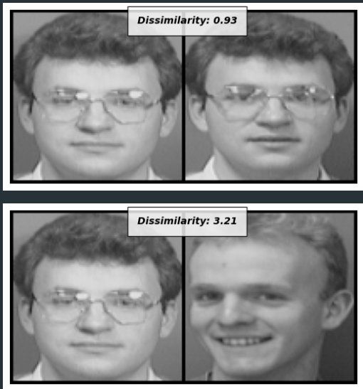
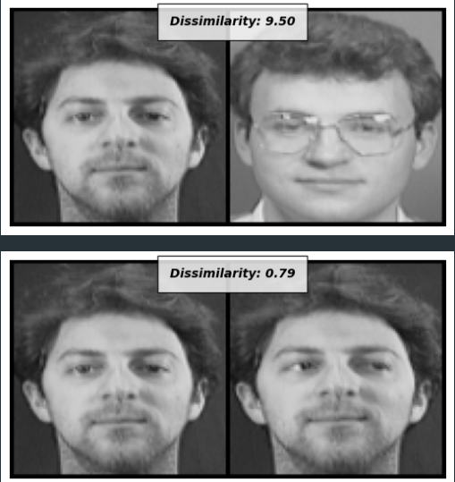
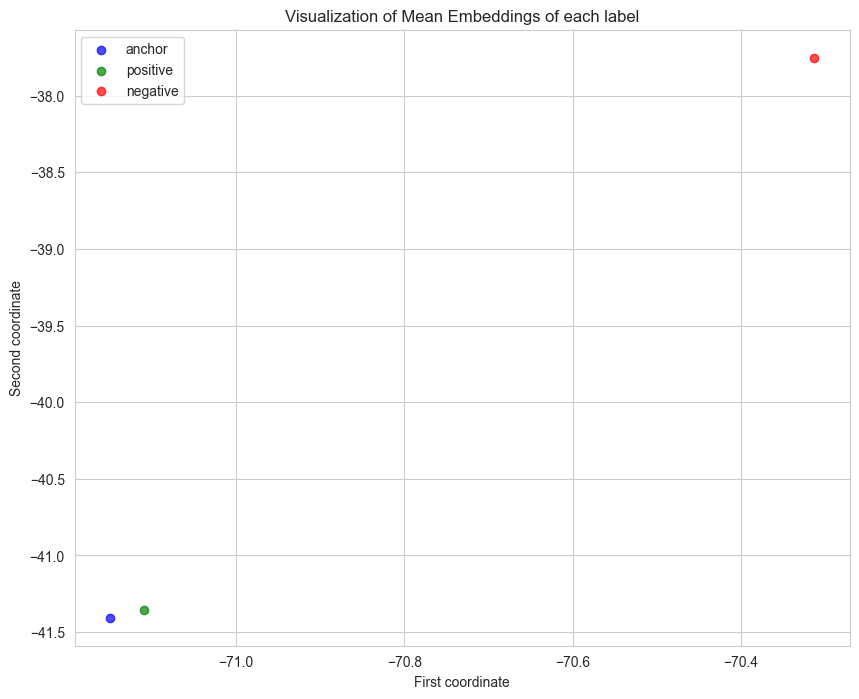

# Siamese Networks

This repository contains the implementation and evaluation of Siamese and Triple networks. 

## Table of Contents
1. [Introduction](#Introduction)
2. [Dataset](#Dataset)
3. [Examples](#Examples)
4. [Evaluation](#Evaluation)

## Introduction
Siamese Networks are a class of neural network architectures that contain two or more identical subnetworks. Identical here implies that they have the same configuration with the same parameters and weights. Parameter updating is mirrored across both subnetworks. They are used in applications where the goal is to detect the difference between two comparable items.

## Dataset
Siamese and Triplet networks trained on ATM images. Siamese networks can be used to protect bank accounts of users.

## Examples 
### Dissimilarity on sample users on Siamese Network

### Dissimilarity on sample users on Triplet Network

## Evaluation
### Siamese Net
Visualization of mean embeddings of Triplet Net, anchor and positive example can be seen near each other while negative samples are far away from them. Siamese network succesfully learned which example is negative or positive.

### Triplet Net
Triplet Net, with its Triplet loss function, can learn a better representation of positive and negative examples. In the image below, the positive and anchor examples appear closer together than when using a Siamese Net, which is desirable because the anchor and positive examples should be as near to each other as possible.
